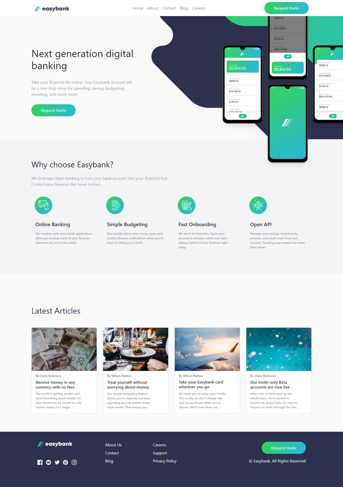
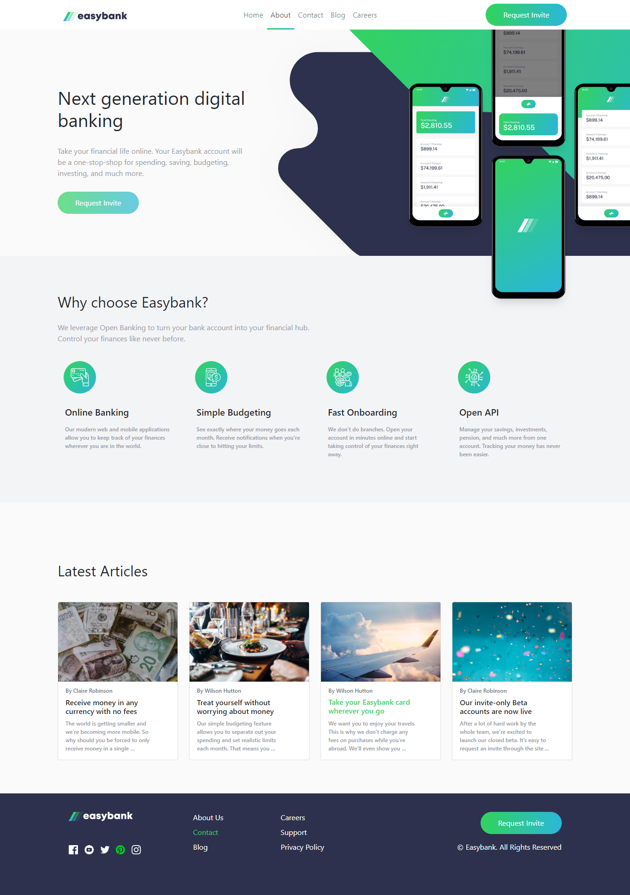
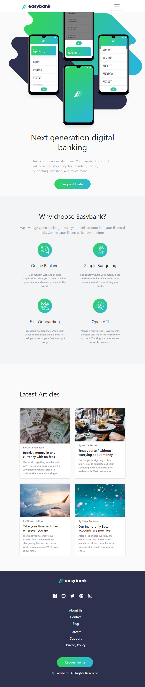
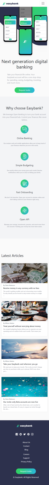

# Frontend Mentor - Easybank landing page

## Welcome! 👋

Thanks for checking out this front-end coding challenge.

## Overview

## The challenge

challenge is to build out landing page

Your users should be able to:

- View the optimal layout for the site depending on their device's screen size
- See hover states for all interactive elements on the page

### Screenshot






### Links

- Solution URL: [Add solution URL here](https://your-solution-url.com)
- Live Site URL: [Add live site URL here](https://your-live-site-url.com)

## My process

### Built with

- Semantic HTML5 markup
- CSS preprocessor
- Flexbox
- CSS Grid
- bootstrap
- Mobile-first workflow

### What I learned

some new class from bootstrap (row-cols) that helped me to control the layout grid of the cards
filter with new property that allows me to control the color of the svg in img element

To see how you can add code snippets, see below:

```html
<div class="row-cols-4">
  <div class="col"></div>
  <div class="col"></div>
  <div class="col"></div>
  <div class="col"></div>
</div>


```

```css
.svg {
  filter: invert(37%) sepia(121%) saturate(429%) hue-rotate(76deg) brightness(
      74%
    ) contrast(141%);
}
```
